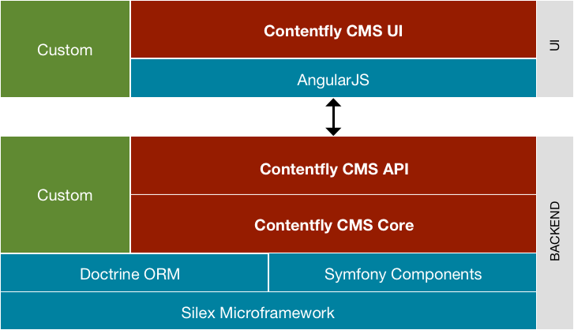

#Architektur Contentfly CMS

## BACKEND

Die Backend-Schicht des Contentfly CMS basiert auf PHP und MySQL und agiert als _Headless CMS_[^1].

### Silex Microframework
Auf der untersten Ebene agiert das Silex Microframework und ist u.a. für Themen wie Routing, 
MVC und Dependency Injection zuständig.

- [Silex Version 2.2.2](https://silex.sensiolabs.org/doc/2.0/)

### Symfony Components und Twig Template Engine
Das Contentfly CMS nutzt Teile der Symfony Components, wie _CONSOLE_, _HTTP KERNEL_, _HTTP FOUNDATION_ oder _ROUTING_.

- [Symfony Components](http://symfony.com/components)
- symfony/console: v3.4.4  
- symfony/debug: v4.0.4  
- symfony/event-dispatcher:  v3.4.4 
- symfony/http-foundation: v3.4.4  
- symfony/http-kernel: v3.4.4 
- symfony/polyfill-mbstring: v1.6.0 
- symfony/polyfill-php70: v1.6.0 
- symfony/routing: v3.4.4 
- symfony/translation: v4.0.4 
- symfony/validator: v4.0.4 

### Doctrine ORM
Für die Datenhaltung kommt das Doctrine ORM (_Object-Relational Mapping_) zum Einsatz.

- [Doctrine ORM Version 2.6](http://www.doctrine-project.org/projects/orm.html)
- doctrine/orm:  v2.6.0  
- doctrine/common:   v2.8.1
- doctrine/annotations:  v1.6.0 
- doctrine/cache:  v1.7.1
- doctrine/collections :  v1.5.0 
- doctrine/inflector:  v1.3.0 
- doctrine/instantiator:  1.1.0  
- doctrine/lexer:  v1.0.1  

### Contentfly CMS Core
Der Kern des Contentfly CMS befindet sich im Projektordner unter _appcms/areanet/PIM_. Der Ordnername _PIM_ ist dabei 
noch historsisch geschuldet, denn das Contentfly CMS war urprünglich als individuelles _Produkt-Informations-Management-System_ (kurz PIM) 
entwickelt worden. Das System erwies sich aber als so flexibel und ausbaufähig, dass es letztendlich die Grundlage 
für das Contentfly CMS diente. Und damit auch bewiesen ist, dass das Contentfly CMS auch als PIM eingesetzt werden kann.

### Contentfly CMS API
Das eigentliche Herzstück, die Schnittstelle des Contentfly CMS. Das Contentfly CMS ist im Grunde als **API-zentriertes** System konzipiert.
Neudeutsch wird diese Art der Software auch als **Headless** CMS benannt. Damit ist die Datenhaltung komplett unabhängig 
von der letztendlichen Ausgabe. Alle Daten und Inhalte sind über eine Schnittstelle, sowohl lesend als auch schreibend, ansprechbar. 

Der zentrale Code für die API steckt in der Datei _appcms/areanet/PIM/Controller/ApiController.php_

- [Nutzung der API](schnittstelle.md)
- [API-Dokumentation](/doku/api/1.4.0)

### Weitere Komponenten

- [Pimple Version 3.2](https://pimple.sensiolabs.org/)
- [Twig Version 2.4](https://twig.sensiolabs.org/)
- [Doctrine DBAL Version 2.6](http://www.doctrine-project.org/projects/dbal.html)

### Custom
Das Contentfly CMS kann über benutzerdefinierten Code flexibel angepasst und erweitert werden, ohne die Update-Fähigkeit 
des Contentfly CMS zu verlieren.

- Event- und Hook-System zur Anpassung von Controller-Ausgaben (_preDispatch/postDispatch_)
- Benutzerdefinierte API-Aufrufe-/Routen und -Ausgaben
- Erweiterung von System-Entitäen (wie z.B. Benutzer oder Gruppen) durch [Traits](http://php.net/manual/de/language.oop5.traits.php)
- Individuelle Frontend-Ausgaben über PHP und Twig-Templates (z.B. für eine Landing-Page)

## USER INTERFACE (UI)

Das Contentfly CMS UI ist die Benutzeroberfläche für das Backend.

### AngularJS

Als Grundlage für das Contentfly CMS UI dient AngularJS, JQuery und Bootstrap.

- [AngularJS Version 1.4](https://angularjs.org/)
- [jQuery Version 2.1](https://jquery.com)
- [Bootstrap Version Version 3.3](https://getbootstrap.com)

### Contentfly CMS UI

Der Code des Contentfly CMS UI befindet sich im Ordner _appcms/areanet/PIM-UI_, dessen Unterordner _assets_ dabei per Symlink 
im Ordner _appcms/public/ui/default_ veröffentlicht ist. Das Contentfly CMS UI lädt nach dem Einloggen über die Schnittstelle _/api/schema_
die Konfiguration des Systems und generiert dynamisch die Oberfläche, Listen und Formulare.

### Custom
Ebenso wie das Backend, kann auch das Contentfly CMS UI individuell angepasst werden.

[^1]: <https://en.wikipedia.org/wiki/Headless_software>