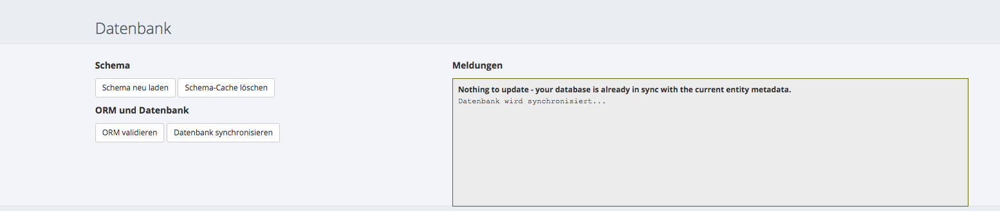
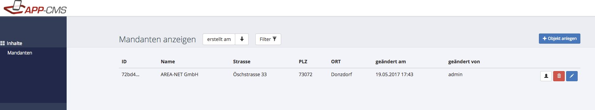
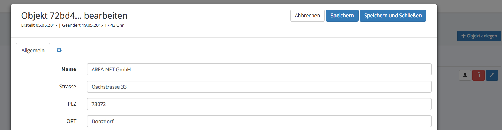

# Erste Schritte

## Installation und Einrichtung

Installieren Sie das APP-CMS nach den entsprechenden [Installations-Anleitungen](installation.md) und rufen Sie im Anschluss das APP-CMS über einen Webbrowser aus.

## Login in das Backend

Nach der Installation können Sie sich mit Benutzername _admin_ und Passwort _admin_ in das Backend einloggen. Vergessen Sie nicht das Passwort nach dem ersten Login abzuändern.


Da Sie bis jetzt noch keine zu pflegende Datenstruktur konfiguriert haben, können Sie natürlich derzeit auch noch keine Daten über das APP-CMS pflegen. 
Beginnen wir also eine erste Datenbank-Tabelle, bzw. eine Doctrine-Entität zu erstellen.

## Erste Entität erstellen

Über das APP-CMS können Sie eine nahezu beliebige Datebankstruktur verwalten. Das APP-CMS verwendet dazu das ORM-Framework Doctrine. 
Eine Datenbank-Tabelle heißt im Doctrine-Chargon Entität. Definieren wir uns also eine erste Entität.

**custom/Entity/Mandant.php**
```
<?php
namespace Custom\Entity;

use Areanet\PIM\Entity\Base;
use Areanet\PIM\Classes\Annotations as PIM;
use Doctrine\ORM\Mapping as ORM;

/**
 * @ORM\Entity
 * @ORM\Table(name="mandant")
 * @PIM\Config(label="Mandanten")
 */
class Mandant extends Base
{
    /**
     * @ORM\Column(type="string", nullable=false)
     * @PIM\Config(showInList=40, label="Name")
     */
    protected $name;

    /**
     * @ORM\Column(type="string", nullable=true)
     * @PIM\Config(showInList=60, label="Strasse")
     */
    protected $strasse;

    /**
     * @ORM\Column(type="string", nullable=true)
     * @PIM\Config(showInList=80, label="PLZ")
     */
    protected $plz;

    /**
     * @ORM\Column(type="string", nullable=true)
     * @PIM\Config(showInList=100, label="ORT")
     */
    protected $ort;

  
    /**
     * @return mixed
     */
    public function getName()
    {
        return $this->name;
    }

    /**
     * @param mixed $name
     */
    public function setName($name)
    {
        $this->name = $name;
    }

    /**
     * @return mixed
     */
    public function getStrasse()
    {
        return $this->strasse;
    }

    /**
     * @param mixed $strasse
     */
    public function setStrasse($strasse)
    {
        $this->strasse = $strasse;
    }

    /**
     * @return mixed
     */
    public function getPlz()
    {
        return $this->plz;
    }

    /**
     * @param mixed $plz
     */
    public function setPlz($plz)
    {
        $this->plz = $plz;
    }

    /**
     * @return mixed
     */
    public function getOrt()
    {
        return $this->ort;
    }

    /**
     * @param mixed $ort
     */
    public function setOrt($ort)
    {
        $this->ort = $ort;
    }
}
```

Die Entität dürfte selbsterklärend sein. Mit dieser Entität können wir in Zukunft unsere Mandanten über die Felder 
_Name_, _Strasse_, _PLZ_ und _Ort_ pflegen - wobei _Name_ dabei ein Pflichtfeld ist.

!!! Annotationen
    Die Konfiguration der Entität erfolgt im APP-CMS über sogenannte Annotationen. 
    Über das Prefix _@ORM_ werden alle bekannten Doctrine-Annotationen[^1] unterstützt. Über das Prefix _@PIM_ können diese mit speziellen 
    Eigenschaften für z.B. die APP-CMS Oberfläche ergänzt werden.
    
##  Datenbank aktualisieren

Sollte Ihr PHP-Installation den Befehl _exec()_ unterstützen und Sie die [Konfigurations-Variable SYSTEM_PHP_CLI_COMMAND](../entwicklung/setup.md#konsole) korrekt gesetzt haben, 
können Sie die Datenbank über die APP-CMS-Oberfläche unter _Administration->Einstellungen->Datenbank_ synchroniseren aktualisieren.



Alternativ können Sie die Datenbank auch über die [Konsole](konsole.md) aktualisieren:

```
#!/bin/bash
php vendor/bin/doctrine orm:schema:update --force
```

## Daten bearbeiten

Im Anschluss sehen Sie auf der linken Seite bereits unsere neu angelegte Entität _Mandant_, die Sie sofort mit Leben befüllen können.



Mit einem Klick auf das Bleistift-Symbol können Sie einen ausgewählten Eintrag natürlich jederzeit beliebig bearbeiten.



## Herzlichen Glückwunsch

Herzlichen Glückwunsch, Sie haben die ersten erfolgreichen Schritte mit dem APP-CMS gemacht und können sich nun in weitere Tiefen vorwagen.

!!! tip "Wussten Sie schon?"
    Wussten Sie schon, dass Sie auf die neu erstellte Entität ohne weitere Zutun bereits über eine API zugreifen können?
    Dazu rufen Sie einfach über einen entsprechenden Webservice-Client folgenden GET-Befehl auf:
    
    _https://ihr-app-cms.de/api/list/Mandant_
    
    Mehr Informationen zur Arbeit mit der [Schnittstelle/API](schnittstelle.md).


    
[^1]: http://docs.doctrine-project.org/projects/doctrine-common/en/latest/reference/annotations.html
    
