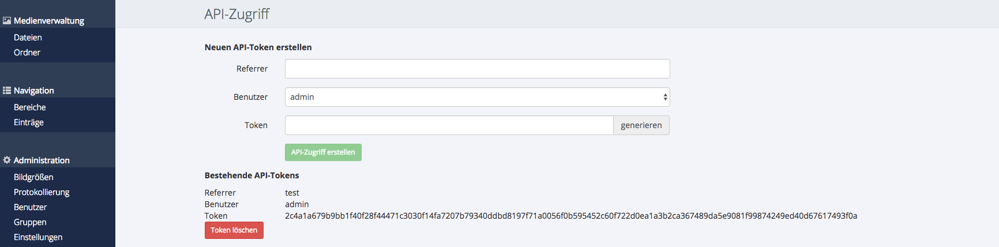

# Schnittstelle

##  Headless CMS

Das APP-CMS wurde ursprünglich als **Headless CMS** konzipiert. Also als Content Management System, 
dass ohne eigene Oberfläche auskommt und lediglich für die Datenhaltung zuständig ist. Da allerdings 
der einfache Zugriff auf die Daten elementar wichtig ist, haben wir auf Basis der Schnitstelle das 
APP-CMS UI ergänzt.

Das APP-CMS ist damit nicht mehr wirklich "headless", die API bleibt aber die zentrale Einheit des APP-CMS. 
Das APP-CMS ist ein **API-zentriertes Content Management System**.

##  Datenformat

Die API nimmt alle Anfragen im JSON-Format entgegen und gibt entsprechend auch wieder Daten im JSON-Format zurück.

## HTTP-Methoden

Im Gegensatz zu REST-Webservices nach Lehrbuch mit GET-, PUT-, DELETE- und POST-Aufrufen, besteht die APP-CMS API
in großen Teilen aus POST-Aufrufen.

```
POST: api/single

REQUEST:
{
  "entity:" : "Mandant",
  "id": "232323-23afdsdf-23fdfss"
}
```

!!! Note "Hinweis"
    In einer nächsten Version des APP-CMS werden beispielsweise auch GET-Aufrufe wie
    _api/single/Mandant/232323-23afdsdf-23fdfss_ möglich sein.

## HTTP-Header

Um die APP-CMS API nutzen zu können, müssen folgende HTTP-Header gesetzt sein:

* **Content-Type**: application/json
* **X-XSRF-TOKEN**: Token zur Authentifizierung

## X-XSRF-TOKEN
Einen Token erhalten Sie zurück, wenn Sie sich über die Login-API per Benutzername und Passwort authentifizieren:

```
POST: auth/login

RESPONSE:
{
    "message" : "Login successful",
    "token" : "69ee5a5eaeea63a6feda2a61ebbb5fcf01b520165948c681bb2dbd5e5f9aae979c829df22aebb3e4948e9816e994756f1f35a63f18eb88f30ab0bc359c70b581",
    "user" : {
        ...
    }
}
```

Der Token ist an den Benutzer gebunden. Damit greifen bei allen API-Aufrufen, die entsprechend für die Benutzergruppe definierten Berechtigungen. Jeder Token
hat eine Laufzeit (_Token-Timeout_). Diese kann über das APP-CMS UI über _Administration->Gruppen_ eingestellt werden.

Alternativ kann über das APP-CMS UI auch ein fester Token für z.b. API-Aufrufe unter _Administration/Einstellungen_ aus einer App angelegt werden:



Jeder Token muss einem Benutzer zugeordnet werden. Das Feld _Referrer_ dient als Titel und wird derzeit nicht weiter ausgewertet.
        
## API-Dokumentation

- [API-Dokumentation](/doku/api/1.3.0)

## Performance-Tipps

Insbesondere beim Abruf über die List-Methode _api/list_ kann es zu Performance-Problemen kommen, da gegebenfalls sehr viele Daten geladen und zurückgegeben werden müssen. 
Folgende Tipps sollen bei der Vermeidung solcher Performance-Probleme vermeiden.

### Abruf über flatten=true

In der Regel werden alle verknüpften Objekte (_join, multijoin_) direkt über die API zurückgegeben. Damit werden mehrere API-Aufrufe vermieden. Bei vielen (verknüpften) Objekten 
kann dies aber zu gewissen Performance-Problemen führen. Zum Einen müssen serverseitig gegebenfalls sehr viele Datenbankaufrufe durchgeführt werden, zum anderen steigt der Aufwand um die Rückgabe 
entsprechend zu parsen und in das JSON-Format umzuwandeln.

Verwenden Sie daher wenn möglich den Parameter _flatten=true_, damit werden nur die ID's und nicht die kompletten Datensätze der verknüpften Objekte zurückgegeben.

```
POST: api/list

REQUEST:
{
    "entity" : "Kunde",
    "flatten" : true
}
```

### Nur benötigte Eigenschaften laden

Im Standard werden automatisch alle Eigenschaften einer Entität über die Schnittstelle zurückgegeben. Laden Sie daher besser nur die Eigenschaften, die sie auch wirklich benötigen.

```
POST: api/list

REQUEST:
{
    "entity" : "Kunde",
    "flatten" : true,
    "properties": ["id", "name", "strasse", "plz", "ort"]
}
```

### Server-Komprimierung verwenden

Verwenden und konfigurieren Sie wenn möglich die serverseitige Komprimierung der Daten. 

**Apache-Komprimierung in der .htaccess:**
```
 <IfModule mod_deflate.c>
     AddOutputFilterByType DEFLATE text/css
     AddOutputFilterByType DEFLATE text/javascript
     AddOutputFilterByType DEFLATE application/x-javascript
     AddOutputFilterByType DEFLATE application/javascript
     AddOutputFilterByType DEFLATE text/x-component
     AddOutputFilterByType DEFLATE text/html
     AddOutputFilterByType DEFLATE text/richtext
     AddOutputFilterByType DEFLATE image/svg+xml
     AddOutputFilterByType DEFLATE text/plain
     AddOutputFilterByType DEFLATE text/xsd
     AddOutputFilterByType DEFLATE text/xsl
     AddOutputFilterByType DEFLATE text/xml
     AddOutputFilterByType DEFLATE image/x-icon
     AddOutputFilterByType DEFLATE application/json
 </IfModule>
``` 

### Caching verwenden

Beachten Sie, dass im Debug-Modus kein Caching verwendet wird. Stellen Sie daher im Produktivbetrieb den Debug-Modus ab. Im Standard verwendet das APP-CMS das Dateisystem für das Caching, 
installieren Sie wenn möglich auf dem Server APC[^1] oder Memcached[^2].

**_custom/config.php_**
```
<?php
   
use \Areanet\PIM\Classes\Config\Factory;
$configFactory = Factory::getInstance();

/*
* Lokaler Server
*/

$configDefault = new \Areanet\PIM\Classes\Config();
$configDefault->APP_DEBUG = true

/*
 * Production Server
 */
$configProduction = new \Areanet\PIM\Classes\Config('www.server.com', $configDefault);

$configProduction->APP_DEBUG = false;
$configProduction->APP_CACHE_DRIVER = 'memcached';  
//'memcached', 'apc', oder 'filesystem' (Standard)

$configFactory->setConfig($configProduction);
```

[^1]: http://php.net/manual/de/book.apc.php
[^2]: http://php.net/manual/de/book.memcached.php